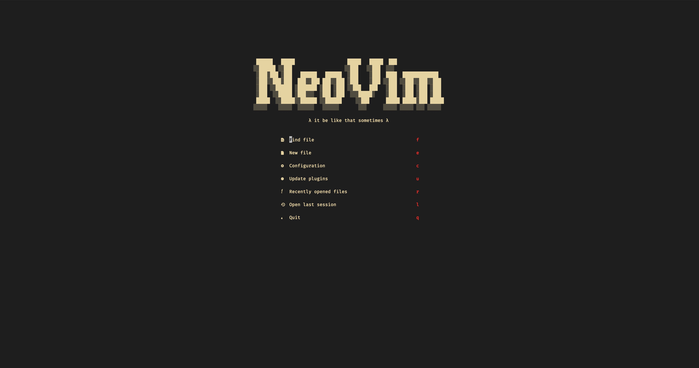
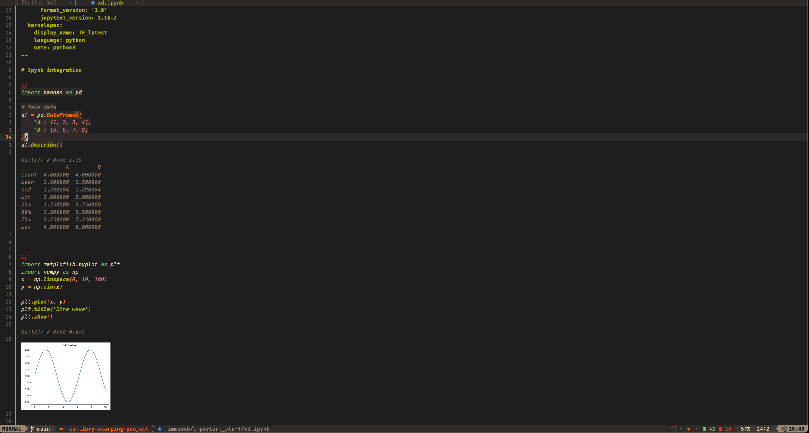

# Neovim Config for Data Science / ML (.ipynb Support)

<a href="https://dotfyle.com/driessenslucas/nvim"></a>
<a href="https://dotfyle.com/driessenslucas/nvim"></a>
<a href="https://dotfyle.com/driessenslucas/nvim"></a>

## Showcase




## Setup Instructions

> Install requires Neovim 0.9+. Always review the code before installing a configuration.

### Clone the Repository

```sh
git clone https://github.com/driessenslucas/nvim.git ~/.config/nvim
```

### Install Dependencies

Run the following commands to install all necessary dependencies:

```sh
# Update package list and upgrade packages
sudo apt-get update
sudo apt-get upgrade -y

# Install essential packages
sudo apt-get install -y nodejs npm luajit ripgrep libmagickwand-dev libgraphicsmagick1-dev luarocks

# Install Python packages
pip install pyperclip plotly kaleido nbformat pillow cairosvg jupyter-client pynvim jupytext jupyter matplotlib

# Install ImageMagick and Luarocks dependencies
luarocks install magick --local --lua-version=5.1

# Determine the Luarocks installation path
LUAROCKS_PATH=$(luarocks path --lr-path)
LUAROCKS_CPATH=$(luarocks path --lr-cpath)
```

### Update Neovim Configuration

Add the Luarocks paths to your Neovim configuration:

```sh
# Create Neovim configuration file if it doesn't exist
NVIM_CONFIG_PATH="$HOME/.config/nvim/init.lua"
mkdir -p $(dirname "$NVIM_CONFIG_PATH")
touch "$NVIM_CONFIG_PATH"

# Update Neovim configuration
echo 'lua << EOF' >> "$NVIM_CONFIG_PATH"
echo "package.path = package.path .. ';${LUAROCKS_PATH//;/\\;}'" >> "$NVIM_CONFIG_PATH"
echo "package.cpath = package.cpath .. ';${LUAROCKS_CPATH//;/\\;}'" >> "$NVIM_CONFIG_PATH"
echo 'EOF' >> "$NVIM_CONFIG_PATH"
```

### Open Neovim with the Config

```sh
NVIM_APPNAME=driessenslucas/nvim nvim
```

## Plugins

| **Category**                  | **Plugin**                                                                                                                                 | **Description**                          |
|-------------------------------|-------------------------------------------------------------------------------------------------------------------------------------------|------------------------------------------|
| **Code Runner**               | [molten-nvim](https://dotfyle.com/plugins/benlubas/molten-nvim)                                                                            | Run code directly within Neovim.         |
| **Completion**                | [nvim-cmp](https://dotfyle.com/plugins/hrsh7th/nvim-cmp)                                                                                   | Autocompletion plugin.                   |
| **Editing Support**           | [zen-mode.nvim](https://dotfyle.com/plugins/folke/zen-mode.nvim)                                                                           | Distraction-free coding.                 |
| **Fuzzy Finder**              | [telescope.nvim](https://dotfyle.com/plugins/nvim-telescope/telescope.nvim)                                                                | Highly extendable fuzzy finder.          |
| **Git Integration**           | [lazygit.nvim](https://dotfyle.com/plugins/kdheepak/lazygit.nvim)                                                                          | Lazygit integration.                     |
|                               | [gitsigns.nvim](https://dotfyle.com/plugins/lewis6991/gitsigns.nvim)                                                                       | Git integration for buffers.             |
| **Icons**                     | [nvim-web-devicons](https://dotfyle.com/plugins/nvim-tree/nvim-web-devicons)                                                               | File icons.                              |
| **LSP**                       | [otter.nvim](https://dotfyle.com/plugins/jmbuhr/otter.nvim)                                                                               | Enhanced LSP support.                    |
|                               | [nvim-lspconfig](https://dotfyle.com/plugins/neovim/nvim-lspconfig)                                                                       | Quickstart configurations for LSP client.|
|                               | [typescript.nvim](https://dotfyle.com/plugins/jose-elias-alvarez/typescript.nvim)                                                         | TypeScript support.                      |
| **LSP Installer**             | [mason.nvim](https://dotfyle.com/plugins/williamboman/mason.nvim)                                                                         | Manage LSP servers, DAP servers, linters, and formatters. |
| **Colorscheme**               | [gruvbox.nvim](https://dotfyle.com/plugins/ellisonleao/gruvbox.nvim)                                                                      | Gruvbox color scheme.                    |
| **Markdown and LaTeX**        | [markdown-preview.nvim](https://dotfyle.com/plugins/iamcco/markdown-preview.nvim)                                                         | Markdown live preview.                   |
| **Media**                     | [img-clip.nvim](https://dotfyle.com/plugins/HakonHarnes/img-clip.nvim)                                                                    | Clipboard image pasting.                 |
|                               | [image.nvim](https://dotfyle.com/plugins/3rd/image.nvim)                                                                                  | Image preview plugin.                    |
| **Note Taking**               | [nabla.nvim](https://dotfyle.com/plugins/jbyuki/nabla.nvim)                                                                               | ASCII math rendering.                    |
| **Neovim Development**        | [plenary.nvim](https://dotfyle.com/plugins/nvim-lua/plenary.nvim)                                                                         | Lua functions.                           |
| **Plugin Manager**            | [lazy.nvim](https://dotfyle.com/plugins/folke/lazy.nvim)                                                                                  | Plugin manager.                          |
| **Preconfigured**             | [LazyVim](https://dotfyle.com/plugins/LazyVim/LazyVim)                                                                                    | Neovim configuration.                    |
| **Programming Languages Support** | [quarto-nvim](https://dotfyle.com/plugins/quarto-dev/quarto-nvim)                                                                     | Quarto support.                          |
|                               | [jupytext.nvim](https://dotfyle.com/plugins/GCBallesteros/jupytext.nvim)                                                                 | Jupyter notebooks powered by Jupytext.   |

## Keybindings

Here are some custom keybindings I use to navigate through the notebook cells:

| **Keybinding** | **Description** |
|----------------|-----------------|
| `<leader>rl`   | Run line.       |
| `<leader>rc`   | Run cell.       |
| `<leader>rr`   | Run range.      |
| `<leader>mn`   | Move to next cell. |
| `<leader>mp`   | Move to previous cell. |
| `<leader>ra`   | Run all above.  |
| `<leader>rb`   | Run all below.  |

## Credits

This configuration is inspired by various resources and contributors within the Neovim community. Special thanks to the authors of the plugins used in this setup.